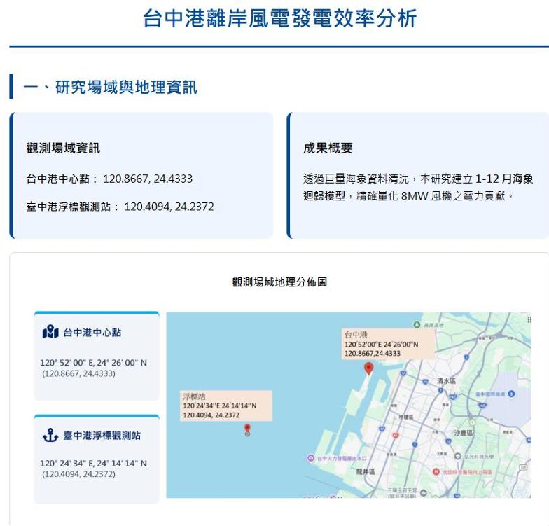
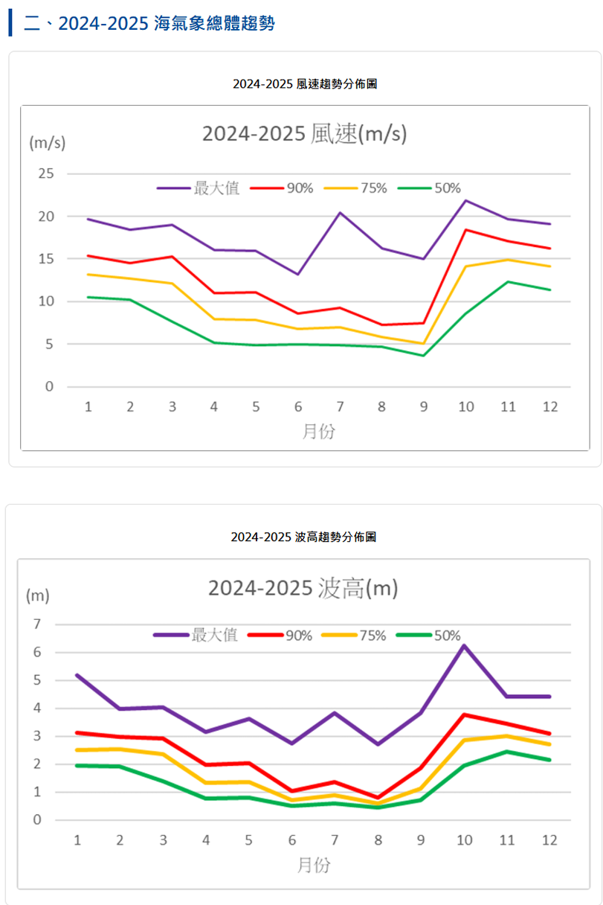
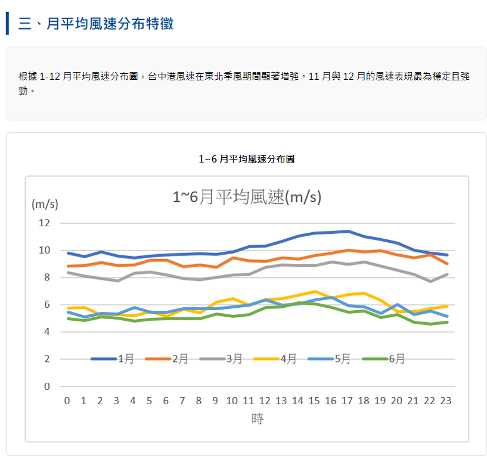
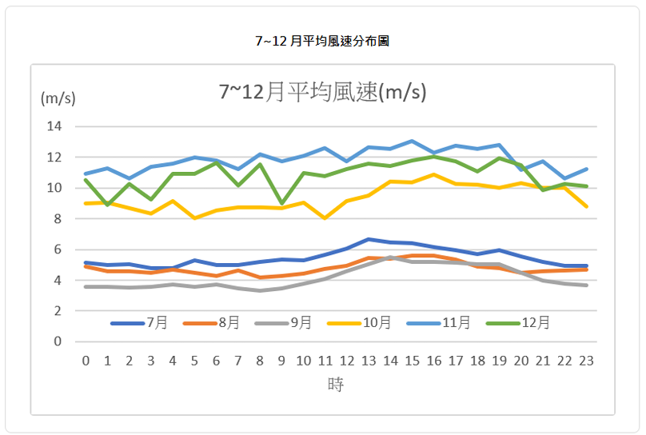
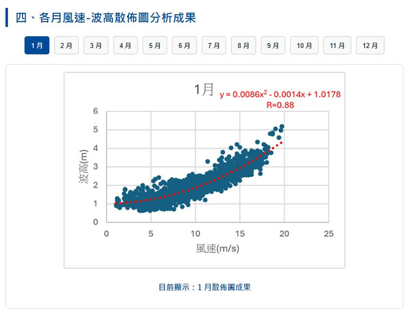
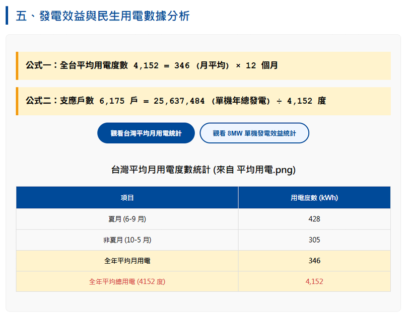
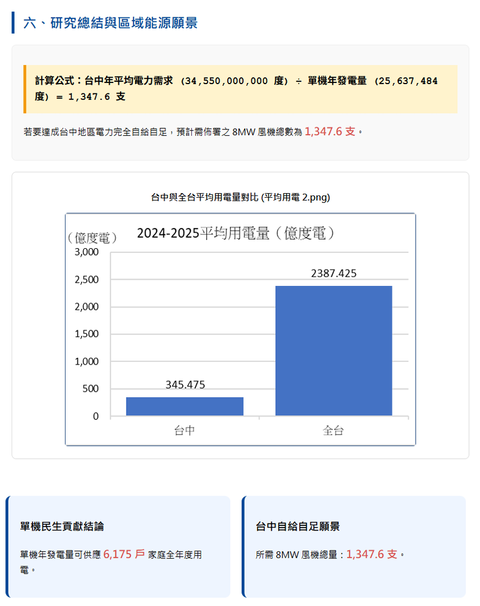

# 114-2 巨量資料與雲端運算 期末專題

## 專題資訊 
 
| 項目     | 說明                      |
| ------ | ----------------------- |
| 課程     | 114-2 巨量資料與雲端運算         |
| 組別     | 第 4 組                   |
| 專題形式 | 小組期末專題                  |
| 專題名稱 | 台中港離岸風電發電效率分析  |
| 應用類型 |  風電發電效率分析儀表板             |

  
## 組員資訊

| 序號 | 姓名  | 學號         |
| -- | --- | ---------- |
| 組長 | 梁峻浤 | C112181154 |
| 組員 | 徐詩雅 | C112181116 |
| 組員 | 温鶴翔 | C112181120 |
| 組員 | 楊蘭歡 | C112181121 |
| 組員 | 邱奕豪 | C112181135 |
| 組員 | 劉振宏 | C112181140 |

## 專題簡介


### 1. 研究核心與目標

本專題聚焦於台中港離岸風電區，旨在解決離岸風電在維運與發電上的季節性「營運兩難」問題（冬季風大浪大難維修、夏季無風導致發電量下降）。

我們開發了一套**離岸風電發電效率動態視覺化管理平台**，將複雜的海氣象數據轉譯為直觀的民生電力指標與互動式視覺化圖表，協助使用者快速了解離岸風電之發電效益與海象特性。

### 2. 使用的數據資料

**數據來源：**

* 台中港浮標觀測站海氣象歷史資料

**數據內容：**

* 涵蓋 2024 至 2025 年期間之觀測資料
* 總計 13,388 筆原始紀錄

**關鍵指標：**

* 風速（m/s）
* 波高（m）
* 觀測時間（DateTime）

### 3. 採用的技術與方法

**開發環境與容器技術：**

* Windows WSL 2
* Docker 容器化部署
* Apache / Nginx Web Server
* FTP Server

**後端與演算法：**

* Python Flask Web API
* 二次迴歸分析（Quadratic Regression）
* 建立 1 至 12 月風速與波高季節性模型

**前端視覺化：**

* HTML5
* CSS3
* JavaScript
* Chart.js

**數據轉譯：**

* 應用風力發電功率公式推估 8MW 離岸風機發電量
* 將 MWh 發電量轉換為可供應家庭戶數
* 以民生用電角度呈現能源效益

### 4. 平台功能特色

**互動式散佈圖分析**

* 點選月份即可查看該月份風速與波高分布情形
* 顯示二次迴歸模型與相關係數分析結果
* 例如：1 月相關係數 R = 0.88

**ESG 指標展示**

* 單支 8MW 離岸風機年發電量約 2,563 萬度
* 約可供應 6,175 戶家庭全年用電
* 推估台中市電力自給所需風機數量約 1,347.6 支

**海象趨勢分析**

* 呈現 2024–2025 年風速與波高長期變化趨勢
* 分析季節性海象規律
* 協助離岸風電維運排程與決策評估


## 系統截圖
這個網頁主要功能是透過整合台中港的海氣象數據，提供視覺化的研究成果展示與互動式的電力效益推估
<p align="center">
  <br>
  地理資訊定位：標註台中港中心點與浮標站精確座標，掌握觀測位置。
</p>
<p align="center">
  <br>
  海象趨勢分析：展示 2024-2025 年風速與波高的長期季節性變化規律。
</p>
<p align="center">
  <br>
  <br>
  逐時風速監測：分析各月份 24 小時內的平均風速，識別高發電效益時段。
</p>
<p align="center">
  <br>
  互動迴歸建模：透過按鈕即時切換各月風速-波高散佈圖與二次迴歸方程式。
</p>
<p align="center">
  <br>
  發電效益轉譯：將發電量自動換算為家戶供電指標（單機可供 6,175 戶）。
</p>
<p align="center">
  <br>
能源願景推估：量化台中達成電力自給自足所需佈署的風機規模（1,347.6 支）。
</p>
                     
## 系統功能

* 使用「台中港浮標觀測站 2024-2025 年觀測資料」作為核心研究數據。
* 支援使用者上傳包含風速與波高之 CSV 原始數據檔。
* 自動檢查必要欄位（風速 m/s、波高 m、觀測時間）是否完整。
* 自動轉換並標準化時間觀測欄位格式。
* 自動篩選與清洗 13,388 筆歷史紀錄中的缺漏值與異常值。
* 排除風速低於 5 m/s（風機啟動門檻）之無效發電紀錄。
* 產出清洗後之分析專用資料集，作為建立 1-12 月海象模型之基礎。
* 提供 1 月至 12 月之按鈕式互動篩選，即時切換各月海象特徵。
* 顯示 ESG 綠能關鍵績效指標 (KPI)：單機年發電量 25,637,484 度、支應 6,175 戶家庭。
* 提供「區域能源願景推估表」，量化台中電力自足所需風機總數（1,348 支）。
* 使用 Python Flask 與前端技術產製互動式各月風速-波高散佈圖與二次迴歸模型。
* 建立 Web 資訊儀表板 (Dashboard)，實現環境數據的數位化管理與可視化展示。
* 後端整合 MySQL 資料庫（經 phpMyAdmin 管理），確保海氣象數據儲存之穩定性。
* 提供 Dockerfile 與基礎環境配置（WSL 2、Docker），實現容器化快速部屬與災難恢復。

## 專案架構

```text
.
├── data/
│   ├── raw/
│   │   └── taichung_buoy_2024_2025.csv      # 台中港浮標站 13,388 筆原始觀測資料 
│   ├── processed/
│   │   └── cleaned_wind_wave_data.csv        # 經資料清洗後之有效發電數據集 
│   └── README.md                            # 數據欄位定義說明 (風速 m/s, 波高 m) 
│
├── docker/
│   └── Dockerfile                           # 容器化部屬配置文件 (Apache/Nginx) 
│
├── docs/
│   ├── final_report.md                      # 期末成果報告書
│   └── presentation.pptx                    # 成果展示簡報
│
├── notebooks/
│   └── regression_analysis_modeling.ipynb   # 1-12 月二次迴歸模型推導程式碼 
│
├── proposal/
│   └── project_proposal.md                  # 專題研究計畫書 
│
├── src/
│   ├── analysis/
│   │   ├── regression_engine.py             # 產出 1-12 月相關係數 R 與方程之核心 
│   │   └── power_calculator.py              # 8MW 風機功率公式與支應戶數演算實作 
│   ├── app/
│   │   ├── static/                          # 存放 12 月份散佈圖與趨勢分佈圖圖片
│   │   ├── templates/
│   │   │   └── index.html                   # 互動式成果展示網頁介面
│   │   └── flask_app.py                     # Python Flask 後端路由與 Web API 
│   ├── database/
│   │   └── schema.sql                       # MySQL 資料庫綱要 (phpMyAdmin 管理) 
│   └── utils/
│       └── data_cleaner.py                  # 自動篩除異常值與低風速 (<5m/s) 程式 
│
├── requirements.txt                         # 專案套件依賴清單 (Flask, Pandas, MySQL) 
└── README.md                                # 專案開發環境 (WSL 2, Docker) 與運行指南
```

## 資料欄位說明

| 欄位              | 說明                        |           
| ------------------ | ----------------------------- |
| `timestamp`         |臺中港浮標觀測站之海氣象觀測記錄時間 |
| `wind_speed_ms`     |逐時風速觀測值，單位為公尺/秒 (m/s) |
| `wave_height_m`     |逐時波高觀測值，單位為公尺 (m) |
| `is_effective`      |標記是否符合風機啟動風速門檻 (≧ 5 m/s) 之有效發電紀錄 |
| `month`             |資料所屬月份，用於建立 1-12 月季節性統計模型 |
| `regression_eq`     |該月份風速與波高之二次迴歸方程式 (y=ax^2+bx+c) |
| `correlation_r`     |風速與波高之相關係數 R，評估模型之解釋能力 |
| `power_gen_mwh`     |套用風力發電功率公式後推估之 8MW 風機發電量，單位為 MWh |
| `supported_households` |依據台灣平均用電轉譯後，該發電量可支應之民生家庭戶數 |

## 使用技術

| 技術                      |   用途                                    | 
| --------------------------| ------------------------------------------|
| Python (Flask)           |專案後端開發框架，負責路由與 Web API 邏輯介接。 |
| Pandas                   |13,388 筆原始海氣象 CSV 數據讀取、清洗與分類統計。 |
| MySQL                    |後端關聯式資料庫，用於結構化儲存各月份海象觀測資料。 |
| HTML5 / CSS3 / JS       |建立互動式 Web 成果展示平台與按鈕互動功能。 |
| Chart.js / Matplotlib      |產製 1-12 月風速-波高散佈圖及長期海象趨勢分析圖表。 |
| Docker                    |執行伺服器（Apache/Nginx）與資料庫之容器化部屬與測試。 |
| WSL2                      |Windows 系統內的 Linux 子系統，提供穩定的虛擬化開發環境。 |
| Git / GitHub                   |版本控制管理，支援組員間的程式碼協作與 GitHub 儲存庫維護。 |

## 專題成果

本專題完成一套「台中港離岸風電發電效率分析web」，能夠從台中港浮標站之海氣象 CSV 原始資料進行自動化清洗、統計分析（如 1-12 月風速-波高二次迴歸）、互動式月份篩選與動態圖表產製
。使用者可透過直觀的 Web 網頁介面操作，不需要撰寫程式即可快速查看各月份海象特徵、8MW 大型風機之發電功率推估，以及「支應 6,175 戶家庭」等 ESG 民生用電指標之轉譯重點。
本系統也透過 Docker 技術進行容器化部屬與測試，確保開發環境（WSL 2）與伺服器運作之穩定性，完全符合課程要求中巨量資料分析、數據視覺化、Docker 容器化與 GitHub 版本控制等技術整合目標。

## 專題要求對照表

| 課程要求                       |           本專題完成方式                                                                     |
| -------------------------------| -------------------------------------------------------------------------------------------  |
| Python 資料分析                 |使用 Pandas 針對台中港浮標觀測站 13,388 筆原始 CSV 數據進行清洗、轉換與統計分析。  |
| 資料視覺化                       |使用 Chart.js 與 Matplotlib 產製 1-12 月風速-波高散佈圖、趨勢分布圖及電力效益儀表板。  |
| Docker 容器化                  |撰寫 Dockerfile，將 Flask 網頁伺服器、Nginx 及 MySQL 資料庫打包成容器，實現快速部屬與災難恢復。 |
| Git 版本控制                    |使用 GitHub 進行團隊協作開發，管理所有程式碼、數據模型及報告書之版本紀錄。 |
| 選擇性技術                      |使用 Python Flask 結合前端互動技術，建置「離岸風電發電效率動態視覺化平台」，實現 ESG 數據轉譯。 |
| Jupyter Notebook                 |使用 Notebook 進行探索式資料分析 (EDA)，推導 1-12 月之海象二次迴歸方程式與相關係數 R。 |
| Pytest 測試                      |執行系統壓力測試，模擬 5 種常見異常問題，確保 Docker 容器服務具備於 10 分鐘內 恢復之穩定性。 |

## 未來改進方向

* 分析船舶運維安全：運用波高資料，深入分析台中港 1-12 月船舶出海運維之航行安全視窗。
* 跨區域效率比較：分析新竹浮標站資料，比較台灣海域北部與中部之離岸風電發電效率差異。
* 優化發電預測模型：透過長期數據累積機制，建立更精確的季節性發電量預測建模。
* 串接即時開放資料 API：嘗試串接中央氣象署即時海氣象資料，提升儀表板的數據時效性。
* 新增 ESG 互動圖表：擴充更多維度的數據轉譯功能，深化綠能數據與社會大眾的溝通。
* 部屬至雲端共享平台：將系統部屬至雲端環境，推動離岸風電環境數據的公開共享與產學合作。

專題必須包含以下技術要素：

1. **Python 資料分析**：使用 Pandas、NumPy 進行資料清洗、轉換與統計分析
2. **資料視覺化**：使用 Matplotlib 或 Seaborn 產出分析圖表
3. **Docker 容器化**：撰寫 Dockerfile，將應用打包為容器
4. **Git 版本控制**：所有程式碼透過 GitHub 管理，commit 紀錄完整

### 選擇性技術（至少包含一項）

- 使用 Keras 預訓練模型進行影像辨識或文字分類
- 使用 Gradio 建立 AI 互動介面
- 使用 Jupyter Notebook 進行探索式資料分析
- 使用 MySQL 資料庫儲存與查詢資料
- 使用 Apache + PHP 建立 Web 前端

## 專題時程

| 週次 | 階段 | 繳交項目 |
|------|------|---------|
| 第 5 週 | 題目探索 | 公布專題題目參考清單，每人開始蒐集有興趣的題目 |
| 第 6 週 | 個人選題 | 每人在自己的 Fork 中建立 `my-topics/` 資料夾，提出 1-3 個題目構想 |
| 第 7 週 | 分組 | 公布分組名單，各組成員互相了解彼此的題目構想 |
| 第 8 週 | 組內討論 | 各組從所有成員的題目中討論、投票，選出一個小組題目 |
| 第 10 週 | 正式提案 | 組長建立專題 Repo，繳交 proposal/proposal.md |
| 第 11 週 | 提案審查 | 教師審查提案，提供修改建議 |
| 第 12-13 週 | 資料收集與分析 | 更新 src/ 和 data/ |
| 第 14-15 週 | 系統開發 | 更新 src/ 和 docker/ |
| 第 16 週 | 整合測試 | 確保 Docker 部署正常 |
| 第 17 週 | 成果展示準備 | 繳交 docs/report.md 和投影片 |
| 第 18 週 | 期末發表 | 口頭報告 + Demo |

## 選題流程說明

專題題目的產生分為四個階段，從個人發想到小組共識：

### 第一階段：個人題目探索（第 5-6 週）

每位同學在自己 Fork 的 Repo 中建立 `my-topics/` 資料夾，提出 1-3 個有興趣的題目。每個題目建立一個 markdown 檔案，格式如下：

```
my-topics/
├── topic1_船舶影像辨識.md
├── topic2_海溫趨勢分析.md
└── topic3_港口壅塞預測.md
```

每個題目檔案需包含：
- 題目名稱
- 為什麼對這個題目有興趣（50 字以上）
- 可能使用的資料來源
- 預計使用的技術

#### 如何找到好題目？

1. **從日常觀察出發**：想想海事或海洋領域中，有什麼問題是你好奇的？
2. **瀏覽資料來源**：先看看有什麼資料可以用，有資料才做得出來
3. **參考本文件的題目清單**：從建議題目中找靈感，也可以延伸或組合
4. **關注新聞時事**：近期有什麼海事相關的議題或事件？
5. **思考實用性**：這個題目做出來，對誰有幫助？能解決什麼問題？

#### 好題目的標準

- 資料取得可行（有公開資料或可自行收集）
- 範圍適中（一學期內 4-5 人可完成）
- 與海事海洋相關
- 能運用課程所學的技術
- 有明確的分析目標或應用場景

### 第二階段：分組（第 7 週）

教師公布分組名單，每組 4-5 人。

### 第三階段：組內討論與投票（第 8 週）

1. 各組成員分享自己提出的 1-3 個題目構想
2. 組內討論每個題目的可行性、有趣程度、技術難度
3. 透過投票或共識決定一個小組題目
4. 可以選擇某位成員的題目，也可以組合多個題目的元素

### 第四階段：正式提案（第 10 週）

由組長或組內討論後的代表：
1. 用模板建立專題 Repo（如 `114-2_BigDataCC-G01`）
2. 邀請組員、老師、助教為 Collaborator
3. 繳交正式的 `proposal/proposal.md`

## 評分標準

| 項目 | 配分 | 說明 |
|------|------|------|
| 專題提案 | 10 分 | 題目合理性、可行性、創新性 |
| 資料分析品質 | 20 分 | 資料清洗完整、分析有洞察、圖表清楚 |
| 程式碼品質 | 20 分 | 結構清楚、有註解、可讀性高 |
| Docker 部署 | 20 分 | Dockerfile 正確、容器可正常執行 |
| GitHub 管理 | 10 分 | commit 紀錄完整、分工明確、PR 使用得當 |
| 口頭報告與 Demo | 15 分 | 表達清楚、Demo 順暢、回答提問 |
| 文件完整度 | 5 分 | README、報告、投影片齊全 |

## 專題題目參考

以下為建議方向，專題須與海事或海洋領域相關。也可自行提案，但需經教師同意。

### 海洋資料分析類

- 台灣近海海溫變化趨勢分析：利用中央氣象署海洋觀測資料，分析近年海溫變化與季節趨勢
- 港口船舶進出資料分析：分析高雄港或其他國際港口的船舶進出頻率、貨運量趨勢
- AIS 船舶軌跡資料視覺化：利用自動識別系統資料，繪製船舶航行路徑與密度熱力圖
- 海洋廢棄物分布分析：整合淨灘資料或海洋廢棄物監測資料，分析分布熱點與種類比例
- 漁獲量與海洋環境關聯分析：結合漁業統計與海溫、洋流資料，探索漁獲量變化因素
- 全球航運碳排放資料分析：分析國際航運碳排放趨勢與減碳政策影響
- 潮汐與海流資料視覺化：利用觀測資料繪製潮汐預報與海流分布圖

### 海事 AI 應用類

- 船舶影像辨識：利用預訓練模型辨識船舶類型（貨輪、油輪、漁船、軍艦等）
- 海洋生物影像辨識：辨識魚類、珊瑚、海洋哺乳類等海洋生物
- 海事新聞自動分類：爬取海事相關新聞，利用 NLP 模型進行主題分類與情感分析
- 海上天氣預警文字分析：分析氣象預報文字，自動判斷航行風險等級
- 港口壅塞預測：利用歷史資料預測港口船舶等待時間

### 海事整合應用類

- 航運資料儀表板：用 Gradio 建立互動式航運資料分析與視覺化儀表板
- 船舶監控系統：結合 AIS 資料與地圖，建立即時船舶位置追蹤介面
- 海洋環境監測平台：整合海溫、鹽度、浪高等資料，建立多指標監測儀表板
- 漁船作業分析系統：利用 VMS 漁船監控資料，分析漁場分布與作業模式
- 港口智慧管理原型：整合船舶進出、貨物、天氣等資料的多容器管理系統

### 建議資料來源

| 資料集 | 來源 | 網址 |
|--------|------|------|
| 海洋觀測資料 | 中央氣象署 | https://ocean.cwa.gov.tw |
| 港口統計資料 | 交通部航港局 | https://www.motcmpb.gov.tw |
| AIS 船舶資料 | MarineTraffic | https://www.marinetraffic.com |
| 全球漁業資料 | Global Fishing Watch | https://globalfishingwatch.org |
| 海洋廢棄物監測 | 環境部 | https://ocean.epa.gov.tw |
| 國際航運統計 | UNCTAD | https://unctad.org/statistics |
| 海洋環境資料 | Copernicus Marine | https://marine.copernicus.eu |
| 台灣漁業統計 | 農業部漁業署 | https://www.fa.gov.tw |

---

## Repo 結構說明

```
114-2_BigDataCC-G01/
│
├── README.md              ← 本檔案：專題總覽與說明
│
├── proposal/              ← 專題提案
│   └── proposal.md        ← 提案內容（第 11 週繳交）
│
├── data/                  ← 資料集
│   ├── raw/               ← 原始資料
│   ├── processed/         ← 清洗後的資料
│   └── README.md          ← 資料來源說明
│
├── src/                   ← 程式碼
│   ├── analysis/          ← 資料分析程式
│   ├── model/             ← 模型相關程式
│   ├── app/               ← 應用程式（Gradio / Flask）
│   └── utils/             ← 共用工具函式
│
├── notebooks/             ← Jupyter Notebook
│   └── exploration.ipynb  ← 資料探索與分析
│
├── docker/                ← Docker 部署
│   ├── Dockerfile         ← 容器建置檔
│   └── docker-compose.yml ← 多容器編排（如需要）
│
├── docs/                  ← 文件
│   ├── report.md          ← 期末報告
│   └── slides/            ← 投影片
│
├── .gitignore             ← Git 忽略規則
└── requirements.txt       ← Python 套件需求
```

## 各資料夾使用說明

### proposal/

第 11 週前繳交專題提案，`proposal.md` 需包含：
- 專題名稱與動機
- 使用的資料集來源
- 預計使用的技術
- 分工規劃
- 預期成果

### data/

- `raw/`：放原始資料檔案（CSV、JSON 等）
- `processed/`：放清洗處理過的資料
- `README.md`：說明資料來源、欄位定義、授權方式
- 注意：大型檔案（超過 100MB）請使用 .gitignore 排除，改在 README 中提供下載連結

### src/

所有程式碼放在此處，依功能分子資料夾：
- `analysis/`：資料分析用的 Python 程式
- `model/`：機器學習模型訓練與推論
- `app/`：Gradio 或 Flask 應用程式
- `utils/`：共用的工具函式

### docker/

- `Dockerfile`：定義容器映像檔的建置步驟
- `docker-compose.yml`：如果使用多個容器（例如 Python + MySQL），用此檔案編排

### docs/

- `report.md`：期末報告，第 17 週前繳交
- `slides/`：發表用投影片

---

## 操作指南

### 組長建立 Repo

1. 到模板頁面點選「**Use this template**」>「**Create a new repository**」
2. Repository name 填入：`114-2_BigDataCC-G01`（替換為你的組別編號）
3. 設為 **Public**
4. 點選 **Create repository**

### 邀請組員和老師

1. 進入 Repo > **Settings** > **Collaborators**
2. 點選 **Add people**
3. 加入組員（權限：**Write**）
4. 加入老師 `pychang-ai` 和助教帳號（權限：**Write**）

### 組員日常操作

```bash
git clone https://github.com/組長帳號/114-2_BigDataCC-G01.git
cd 114-2_BigDataCC-G01

# 每次工作前先拉最新版本
git pull origin main

# 完成工作後
git add .
git commit -m "描述你做了什麼"
git push origin main
```

### 建議的 commit 訊息格式

```
[分類] 說明

範例：
[data] 新增台北市交通資料 CSV
[analysis] 完成資料清洗與缺失值處理
[model] 加入 ResNet50 影像辨識功能
[docker] 建立 Dockerfile 和 docker-compose
[docs] 更新期末報告初稿
[fix] 修正資料讀取路徑錯誤
```

---

## 注意事項

1. 每位組員都要有 commit 紀錄，不接受只有一人提交的專題
2. 資料集請注明來源與授權方式，不可使用未經授權的資料
3. 程式碼需有適當的註解，方便他人理解
4. Docker 部署必須能在乾淨的環境中正常啟動
5. 期末報告和投影片請在第 17 週前上傳
